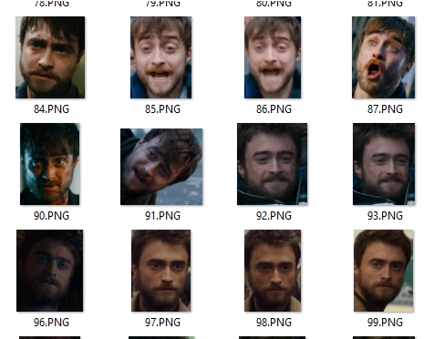
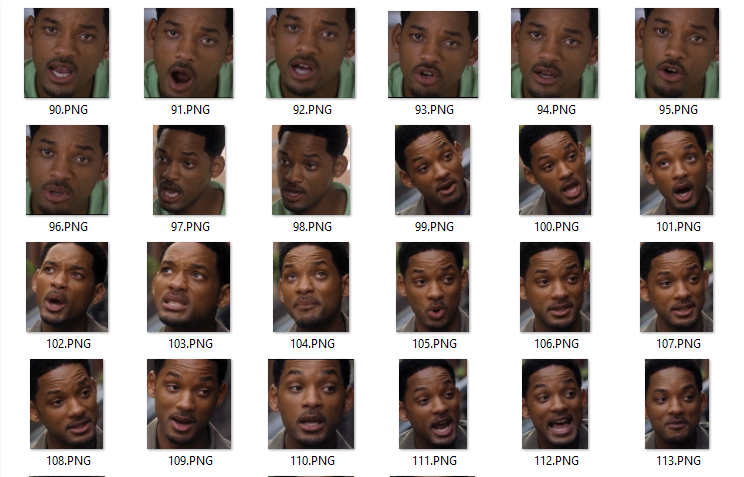

# bachelor-diploma

## Overview
Дипломный проект бакалавриата, который предназначен для верификации личностей с помощью нейронных сетей. Реализован с использованием моделей библиотеки dlib и классификатора на основе полносвязной сети.

## Данные
Датасет был собран вручную, собранная база данных состоит из 6 классов, для каждого класса по 500 изображений. Был написан код программы, которая делает скриншоты по нажатию клавиши.

### Изображения из датасета

    

    

